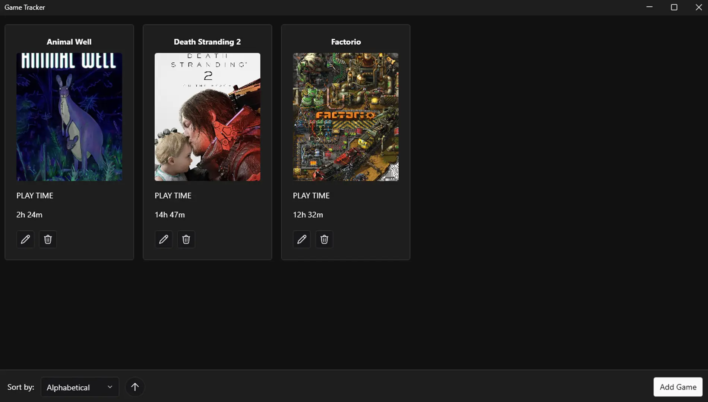

# Game Tracker
Track playtime across non-Steam games.

# Notice
The app is left running in background if you quit the main form, to quit the app you need to close it in the 'System Tray'. 

You need to select an .exe of a game you want to track.  

# Save Location
Save files are located here: C:\Users\\\<USER\>\AppData\Roaming\GameTracker

# Requriements
- Windows 10/11
- .NET 10.0
